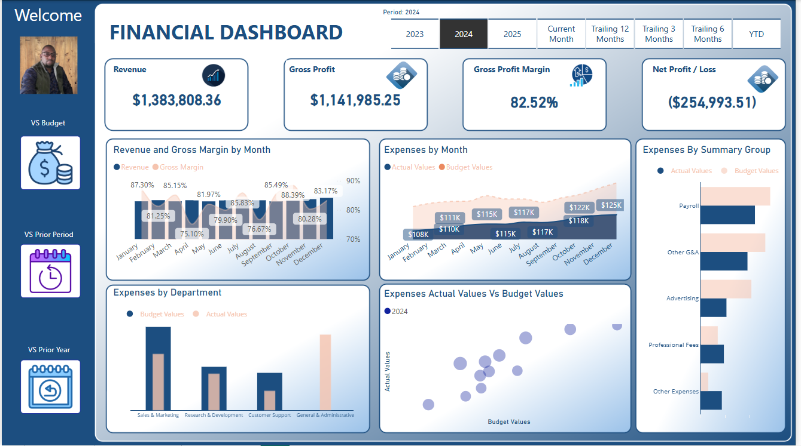
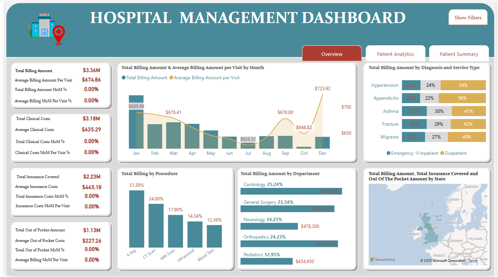
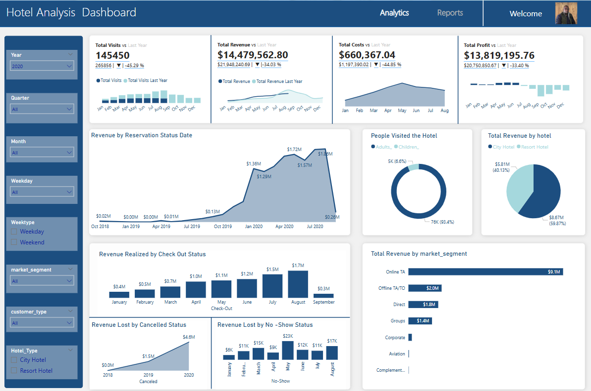
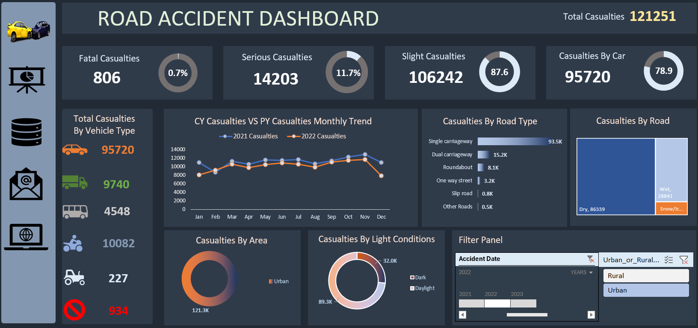

# WESSEL TANGAI
### BUSINESS INTELLIGENCE PORTFOLIO

**I turn complex data into clear, decision-ready stories.**

Power BI · Excel · SQL · Power Query · Data Modelling

[Explore the projects](#selected-projects) · [View my GitHub profile](https://github.com/chrisWessel)

---

## The work

I build practical analytics experiences: shaping data, modelling it for analysis, and presenting the results in dashboards that make the next question easier to answer.

This portfolio brings together projects across finance, healthcare, travel, hospitality, road safety, and sales. Selected projects include their original Power BI or Excel deliverables and source workbooks; each project page explains the question, approach, and tools.

## Selected projects

<table>
  <tr>
    <td width="50%" valign="top">
      
      <h3>Financial performance</h3>
      Budget vs. actuals, period comparisons, revenue, profit, and expense analysis.
       <b>Power BI · Excel · Power Query</b>
    </td>
    <td width="50%" valign="top">
      
      <h3>Hospital operations</h3>
      A multi-page view of visits, costs, service mix, and patient experience.
       <b>Power BI · SQL · Data modelling</b>
    </td>
  </tr>
  <tr>
    <td width="50%" valign="top">
      
      <h3>Hotel revenue</h3>
      Booking, revenue, cost, and profit trends with interactive time and segment filters.
       <b>Power BI · Excel · Power Query</b>
    </td>
    <td width="50%" valign="top">
      
      <h3>Sales performance</h3>
      Revenue, COGS, profit, and margin explored by product, customer, location, and time.
       <b>Excel · Power Query · Data modelling</b>
    </td>
  </tr>
  <tr>
    <td width="50%" valign="top">
      
      <h3>Road safety</h3>
      Casualty severity and patterns by vehicle, road type, area, and light conditions.
       <b>Excel · Interactive dashboard</b>
    </td>
    <td width="50%" valign="top">
      
      <h3>Healthcare analytics</h3>
      An aggregate view of admissions, billing, length of stay, and condition patterns.
       <b>Power BI · SQL · Data modelling</b>
    </td>
  </tr>
</table>

### More projects

| Project | Focus | Tools and examples |
| --- | --- | --- |
| [Airline reviews](projects/airline-customer-experience/README.md) | Ratings, recommendation, route, travel class, and customer segment | Power BI · SQL |
| [Stroke data exploration](projects/stroke-data-exploration/README.md) | An exploratory health-data dashboard; not a diagnostic tool | Power BI |

## How I work

1. **Understand the question** — identify the decisions and measures that matter.
2. **Prepare the data** — clean, shape, and validate it with Power Query and SQL.
3. **Model for analysis** — organize relationships and measures around the questions.
4. **Design the experience** — make the important signal easy to find and explore.
5. **Check the result** — reconcile totals, test filters, and make assumptions visible.

## Project files and data

- Original Power BI, Excel, and dataset files are included for selected projects; see each project README for direct links.
- Dashboard previews and project notes for all listed projects.
- SQL Server examples for hospital operations, healthcare utilization, and airline reviews. They use staging schemas and contain no source records.
- Patient-level health data, reviewer identities and free-text reviews, Fastjet company-finance source files, and tutorial videos are not published.
- Before republishing, confirm you have permission to share source files and that no personal or confidential data is embedded in a dashboard or workbook.

## Tools

**Power BI** · **Microsoft Excel** · **Power Query** · **SQL Server (T-SQL)** · **Data modelling**

---

**Thanks for stopping by.**

[More from Wessel on GitHub](https://github.com/chrisWessel)

