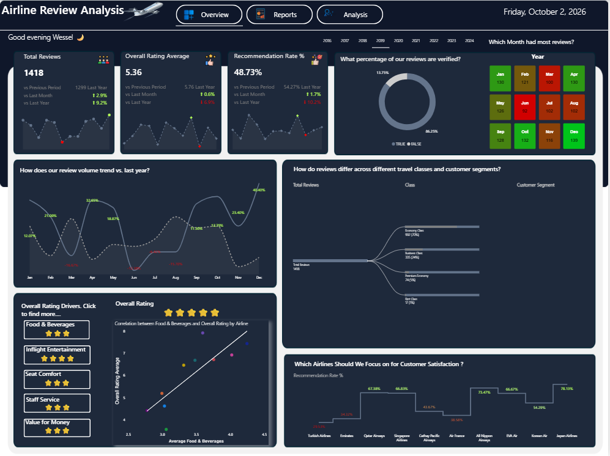
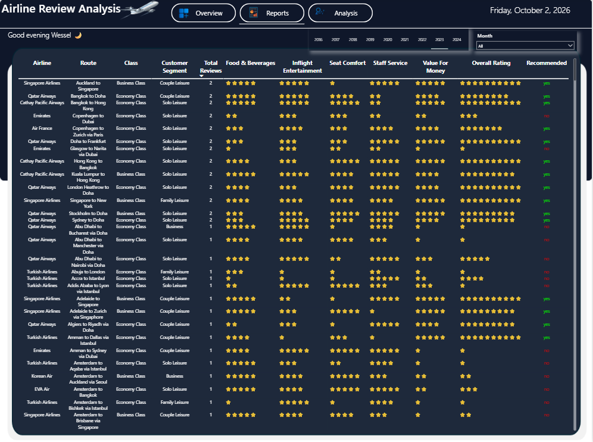
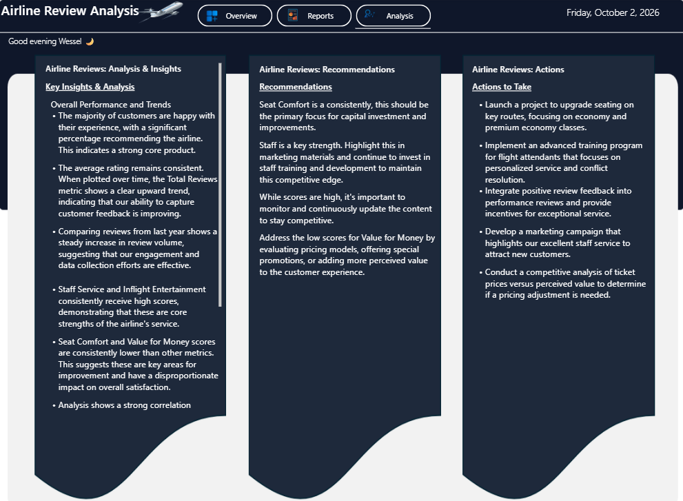

# Airline customer experience

A review-analysis dashboard concept for comparing ratings and recommendation patterns across airlines, routes, travel classes, and customer segments.

## Questions explored

- Which airlines and travel classes receive the strongest overall ratings?
- How do service attributes such as comfort, staff, food, and value compare?
- How do recommendation rates vary across routes and customer segments?

## Tools

Power BI · SQL Server (T-SQL) · Data modelling

## Report screenshots

## Recommendations

- Pilot seat-comfort improvements on key routes, especially in economy and premium-economy classes; compare class-specific ratings and recommendation rates before and after.
- Protect strengths in staff service and inflight entertainment through continued training and recognition, while monitoring service ratings over time.
- Investigate lower value-for-money scores by comparing fares and included benefits by route and class; test targeted offers before broad pricing changes.
- Track recommendation rate alongside review volume and overall ratings to assess whether service changes improve customer experience.

## SQL example

[`sql/01_airline_reviews.sql`](sql/01_airline_reviews.sql) creates an analysis-ready schema that excludes reviewer names and free-text reviews, then provides airline, class, and recommendation summaries.

## Privacy

The published screenshots omit reviewer names and free-text review fields. No reviewer identities, review text, source CSV, or PBIX file is published. The recommendations summarize patterns shown in the report and should be validated with current operational data.
