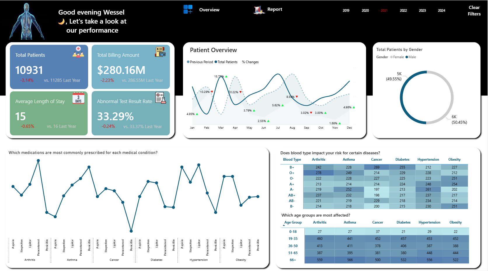

# Healthcare analytics dashboard

An aggregate view of admissions, billing, length of stay, test results, and condition patterns.

## Questions explored

- How do admissions, billing, and length of stay change over time?
- How are conditions and test-result categories distributed?
- Which broad age, gender, and medication categories appear most often?

## Tools

Power BI · SQL Server (T-SQL) · Excel · Data modelling

## SQL example

[`sql/01_healthcare_utilization.sql`](sql/01_healthcare_utilization.sql) demonstrates aggregate utilization and billing queries on a de-identified analytical schema. It deliberately excludes patient names, doctor names, and free-text fields.

## Recommendations

- Examine condition and time segments associated with longer stays or higher billing, then validate the underlying case mix before acting.
- Review length of stay alongside readmissions and outcomes where those measures are available, rather than optimizing stay duration alone.
- Use the dashboard to frame operational questions only; validate any proposed care changes with qualified clinical teams and governed data.

## Important context

This is a dashboarding and data-analysis example, not a clinical decision-support or diagnostic tool. The preview is aggregate; no source records are published.
