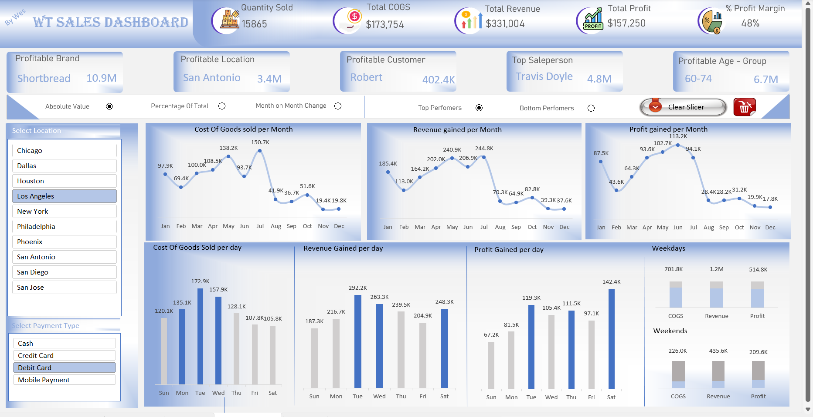

# Sales performance dashboard

An Excel dashboard that brings product and customer performance together with core commercial measures.

## Report pages

## Questions explored

- How do sales revenue, cost of goods sold, profit, and margin compare?
- Which products, customers, locations, and salespeople contribute most?
- How do daily and monthly patterns differ, and how do slicers change the view?

## Tools

Microsoft Excel · Power Query · Data modelling

## Portfolio notes

The preview features interactive selections and headline sales measures.

## Recommendations

- Prioritize products and customer segments that contribute sustained profit, not just high sales revenue.
- Investigate low-margin products and locations to understand cost or pricing drivers before using broad discounts.
- Use salesperson and customer breakdowns to identify support or growth opportunities, comparing like-for-like sales periods.

## Project files

- [Interactive Excel sales dashboard](files/WT%20Buscuits%20Sales%20Analysis.xlsm)
- [Practice dataset](data/WT%20Practice%20Dataset.xlsx)

The workbook is macro-enabled. Review macros according to your organization's security practices before enabling them in Excel.
