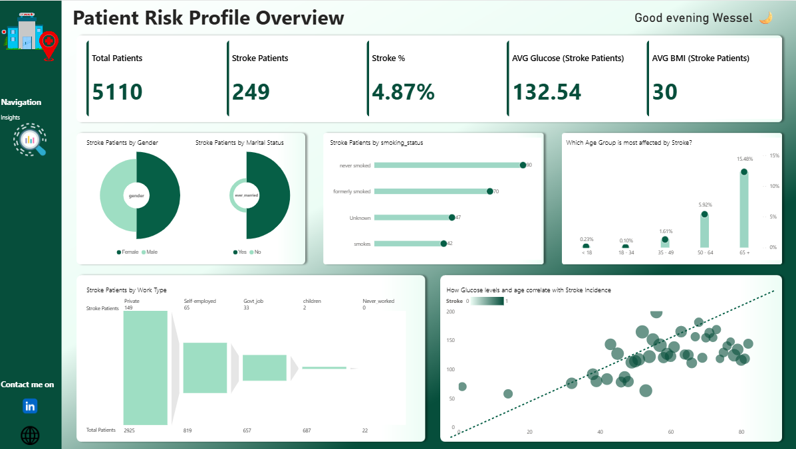
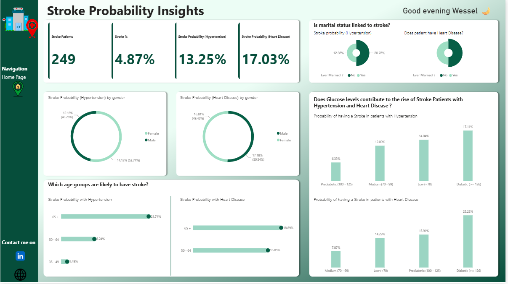

# Stroke data exploration

A Power BI dashboard project exploring patterns in health-related data.

## Scope

This is a descriptive data-visualization project only. It does not provide an individual risk score, diagnosis, or clinical recommendation.

## Tools

Power BI · Excel · Data modelling

## Recommendations

- Treat the age and health-condition patterns as population-level associations to investigate, not causal findings or individual risk estimates.
- Validate cohort sizes, missing values, and category definitions before comparing reported percentages or sharing conclusions.
- Do not use this dashboard to guide screening or care; any future health intervention would need qualified clinical review and independent validation.

## Privacy

The public screenshots show aggregate report pages. The report file and source workbook are not included in this archive because they may contain health-related records. This project is for descriptive analysis only and is not a diagnostic or clinical decision-support tool.
