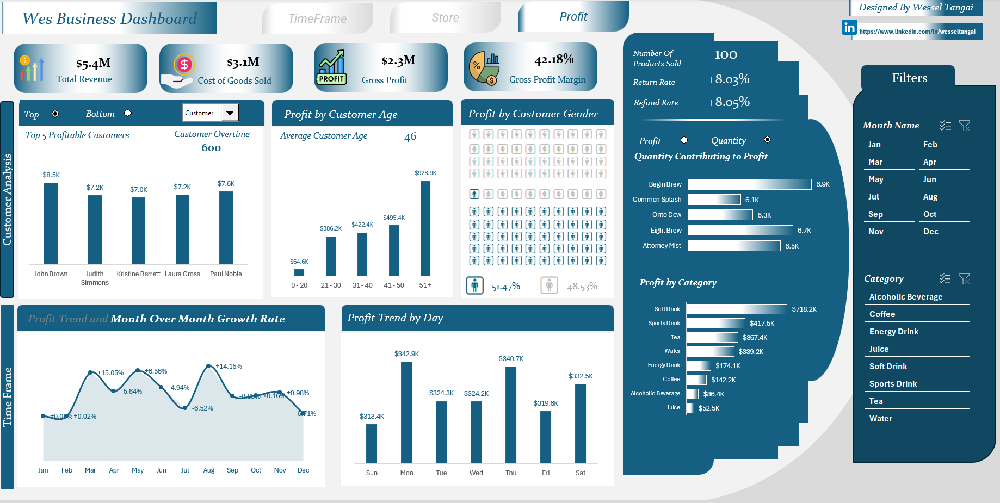

# Wes Business sales dashboard

An interactive Excel dashboard for tracking revenue against monthly targets and exploring store, product, and customer profitability.

## Report pages

## Questions explored

- How does sales revenue compare with monthly store targets?
- Which stores and products contribute most to sales and profit?
- How does performance change across selected time periods?

## Tools

Microsoft Excel · Power Query · Data modelling

## Recommendations

- Review stores with repeated shortfalls against monthly targets and agree on a focused recovery action with each store lead.
- Prioritize product and category decisions using profit contribution alongside revenue and target variance.
- Track store performance over comparable months to separate persistent gaps from seasonality or one-off fluctuations.

## Project files

- [Interactive Wes Business dashboard](wes-business-sales-dashboard.xlsb)
- [Dashboard tasks and requirements](dashboard-tasks.pdf)
- [Dashboard — timeframe view](assets/dashboard-timeframe.png)
- [Dashboard — store view](assets/dashboard-store.png)
- [Dashboard — profit view](assets/dashboard-profit.png)
- [Customer data](data/customers_table.csv)
- [Sales transactions](data/fact_table.csv)
- [Monthly store targets](data/monthly_store_targets.csv)
- [Product data](data/products_table.csv)
- [Salesperson data](data/sales_persons_table.csv)

## Data note

The dashboard and supporting records are presented as a portfolio demonstration. Verify data permissions and workbook macros/security settings before reusing the files in another environment.
